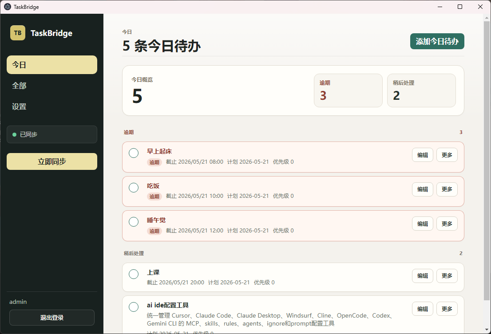
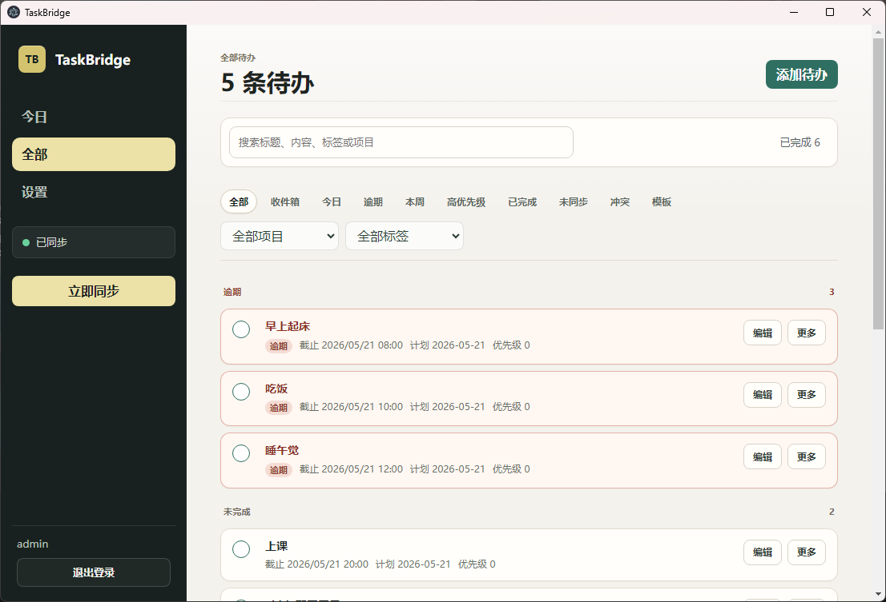
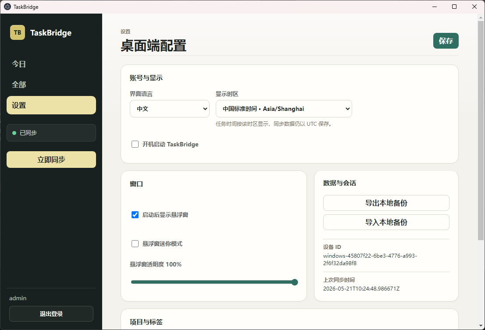
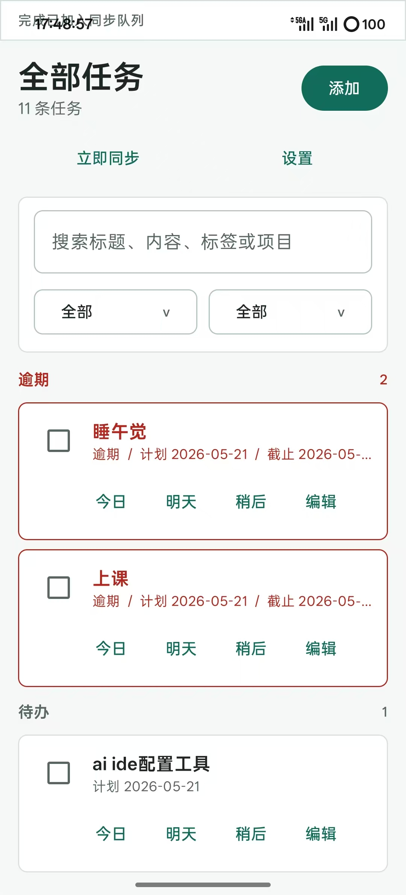
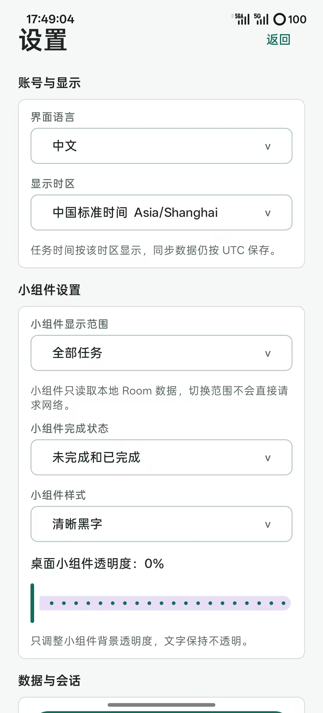
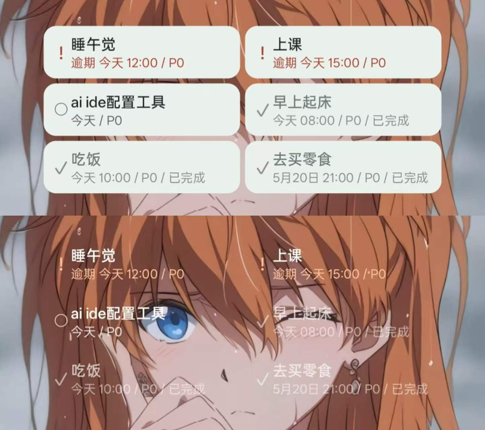
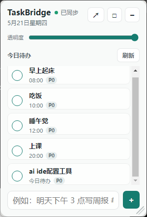

# TaskBridge

[](https://github.com/27xk/TaskBridge/actions/workflows/ci.yml)
[](https://github.com/27xk/TaskBridge/releases)
[](https://github.com/27xk/TaskBridge/releases)

TaskBridge 是一个登录后本地优先的跨端待办应用。首次使用需要连接一个 TaskBridge 服务器；登录并同步过后，手机、电脑和桌面小组件都能继续离线查看和处理本机任务，网络恢复后会自动同步到其他设备。

它适合需要在多个设备之间切换工作的用户：在电脑上快速录入任务，在手机上接收提醒，在桌面小组件里扫一眼今天要做什么。

## 入口

- **下载：** [GitHub Releases](https://github.com/27xk/TaskBridge/releases)
- **普通用户快速开始：** [普通用户快速开始](./docs/user-quick-start.md)
- **已有服务器地址：** 按下面的普通用户快速开始下载客户端并登录。
- **没有服务器地址：** 先看下面的本机试用或自托管路径。

## 普通用户快速开始

先按这一句选择路径：已有服务器地址就直接登录；没有服务器地址再选择本机试用或长期自托管。

如果你已经拿到服务器地址和账号，普通使用不需要安装部署工具、不需要处理网络地址细节，也不需要阅读部署命令。只要打开客户端，填写服务器地址并登录。

| 你的情况 | 先做什么 | 需要看的说明 |
| --- | --- | --- |
| 已有服务器地址 | 下载客户端或打开部署者提供的 Web/PWA 地址，然后登录 | 下面的“已有服务器地址” |
| 本机试用 | 没有服务器地址时，按本机试用说明启动服务，再回到客户端填写地址 | 下面的“没有服务器地址” |
| 长期自托管 | 先完成自托管服务，再把正式服务器地址填到客户端 | `deploy/README.md` |

### 已有服务器地址

如果管理员已经给你 TaskBridge 服务器地址和账号，直接按下面的路径开始：

1. 如果使用 Web/PWA，打开部署者提供的 TaskBridge 访问地址。
2. 如果使用桌面或手机客户端，打开 [Releases](https://github.com/27xk/TaskBridge/releases)，下载 Windows 安装包或 Android APK。
3. 在登录页填写管理员或部署者给你的服务器地址。
4. 直接登录同一个账号。登录会自动检查连接；“检查连接”只用于排查服务器地址。

### 没有服务器地址

- **本机试用：** 只想先在自己的电脑上体验同步流程时，按[部署说明的本机试用](./deploy/README.md#本机试用)启动服务，再把说明里给出的服务器地址填到客户端。
- **长期自托管：** 准备长期使用、多人使用或公网访问时，按[部署说明](./deploy/README.md)完成生产配置，再把正式服务器地址填到客户端。

说明：

- 安装包可能带有默认服务器地址；如果登录页地址不对，请在登录页或设置页填写管理员给你的服务器地址。
- 桌面端安装后可以在「设置」里修改服务器地址。
- Android 端可以在登录 / 注册页的「连接设置」或设置页修改服务器地址。
- 桌面端和 Android 端都优先填写「服务器地址」；高级连接设置通常不需要修改。
- 手机或另一台电脑访问本机试用服务时，以部署说明里的客户端地址为准。
- 离线新增、编辑和完成任务依赖本机已有登录会话；如果是第一次打开，请先完成一次登录。

普通使用不需要阅读开发者说明；登录、离线使用和同步状态处理都在客户端内完成。下面的开发者和自托管内容只适合维护、部署或排障时继续阅读。

## 截图

> 截图仅展示当前版本的主要工作区；连接、注册、同步和权限设置以当前客户端实际页面为准。

### Windows 桌面端

<p align="center">
  
</p>

<table>
  <tr>
    <td align="center" width="50%">
      
      <br>
      <sub>全部任务</sub>
    </td>
    <td align="center" width="50%">
      
      <br>
      <sub>基础设置</sub>
    </td>
  </tr>
</table>

### Android App

<p align="center">
  
  &nbsp;&nbsp;
  
</p>

### 桌面小组件与悬浮窗

<table>
  <tr>
    <td align="center" width="58%">
      
      <br>
      <sub>Android 小组件</sub>
    </td>
    <td align="center" width="42%">
      
      <br>
      <sub>Windows 悬浮窗</sub>
    </td>
  </tr>
</table>

## 你可以用它做什么

- 在电脑上记录工作任务，切到手机后继续查看。
- 登录并同步过后，可以在离线状态下新增、编辑、完成任务，稍后自动同步。
- 用今日视图区分逾期、待办和已完成任务。
- 通过 Android 小组件查看今天的任务。
- 用 Windows 悬浮窗常驻显示今日待办。
- 自建后端，数据保存在自己的服务器中。

## 功能

- **登录后的本地优先：** 首次完成登录后，没网时也能新增、编辑和完成任务。
- **多端同步：** 网络恢复后，修改会自动同步到其他设备。
- **冲突处理：** 多台设备同时改同一条任务时，客户端会提示用户选择保留哪一份。
- **今日待办：** 支持计划日期、截止时间、逾期判断、已完成排序和今日视图。
- **Android 小组件：** 支持清晰黑字和透明白字两套样式。
- **Windows 桌面端：** 提供主窗口、系统托盘、悬浮窗、全局快捷键、本地提醒和可持久化的桌面端主题。
- **自托管：** 可以把服务部署在自己的电脑、NAS 或服务器上。

## 开发者和自托管说明

### 维护者入口

- **Demo 演示：** [演示脚本](./docs/demo.md)
- **一键部署：** [部署说明](./deploy/README.md)
- **发布与镜像：** [GitHub 发布说明](./docs/github-release.md)
- **容器镜像：** [GHCR / Docker Hub](https://github.com/27xk/TaskBridge/pkgs/container/taskbridge)
- **路线图：** [Roadmap](./ROADMAP.md)
- **参与贡献：** [CONTRIBUTING.md](./CONTRIBUTING.md)

### 自托管后端

复制以下命令即可启动后端、MySQL 和 Redis：

```bash
git clone https://github.com/27xk/TaskBridge.git
cd TaskBridge/deploy
cp .env.local.example .env
docker compose -f docker-compose.release.yml up -d
```

Windows PowerShell：

```powershell
git clone https://github.com/27xk/TaskBridge.git
cd TaskBridge\deploy
Copy-Item .env.local.example .env
docker compose -f docker-compose.release.yml up -d
```

本机试用请使用 `.env.local.example`；正式部署到公网或共享服务器时，再按 `deploy/README.md` 的生产配置替换密码、密钥和域名。

默认服务器地址：

```text
http://127.0.0.1:8000
```

如果要让手机或其他电脑访问，请把客户端后端地址改成服务器的局域网 IP 或域名，例如：

```text
http://192.168.1.10:8000
```

## 开发启动

### 后端

```powershell
cd backend
python -m venv .venv
.\.venv\Scripts\Activate.ps1
pip install -r requirements-dev.txt
Copy-Item .env.example .env
alembic upgrade head
uvicorn app.main:app --host 0.0.0.0 --port 8000 --reload
```

### Android

```powershell
cd android
.\gradlew.bat :app:assembleDebug
```

连接本机模拟器后端：

```powershell
.\gradlew.bat :app:assembleDebug `
  -PTASKBRIDGE_BASE_URL=http://10.0.2.2:8000/api/v1/ `
  -PTASKBRIDGE_WS_URL=ws://10.0.2.2:8000/ws/sync
```

### Windows 桌面端

```powershell
cd desktop
npm ci
npm run dev
```

### Web/PWA

```powershell
# 先启动后端，再启动静态 Web 客户端
python -m http.server 8080 -d web
```

默认地址：

```text
http://127.0.0.1:8080
```

需要在后端设置允许的浏览器来源。生产环境请写明确的 HTTPS Web/PWA 来源：

```text
WEB_CORS_ORIGINS=https://taskbridge.example.com
```

仅本机试用可以使用 `WEB_CORS_ORIGINS=*`，方便手机、局域网电脑和 Web/PWA 同时访问开发后端；正式部署不要使用通配来源。

Web/PWA 支持登录、注册、任务新建、编辑、完成、删除、恢复、搜索和同步状态查看。断网时可以继续查看和修改本机任务，网络恢复后会自动同步；如果同一条任务在其他设备也被修改，页面会对比这台设备版本和同步来的版本，让用户选择保留哪一版。

## 开发者技术栈

| 模块 | 技术 |
| --- | --- |
| 后端 | Python 3.11、FastAPI、SQLAlchemy 2.x、Alembic、MySQL、Redis、JWT、Docker |
| Android | Kotlin、Jetpack Compose、Room、Retrofit、OkHttp WebSocket、WorkManager、DataStore、AppWidget |
| Web/PWA | 静态 HTML、CSS、JavaScript、Service Worker、Manifest、IndexedDB 离线队列 |
| Windows 桌面端 | Electron、Vue 3、TypeScript、Pinia、SQLite、轻量 JSON 配置、electron-builder |
| 同步 | HTTP 增量同步、同步队列、WebSocket 通知、任务版本控制、软删除 |

## 开发者常用验证命令

```powershell
# 首次拉取或依赖缺失时，先补齐本地验证依赖
.\scripts\bootstrap-local.ps1

# 本地统一验收入口；缺失依赖会在汇总中标记为 blocked 并让脚本失败
.\scripts\check-local.ps1

# check-local 会同时运行版本来源、Web/PWA 静态守卫、离线优先守卫、离线核心行为回归和 HTTP smoke
# 确认 index、CSS、JS、Manifest、Service Worker、本机缓存、离线视图过滤与图标都能通过行为守卫或本地 HTTP 访问

# 只生成报告，blocked 不会影响退出码
.\scripts\check-local.ps1 -ReportOnly

# 一条命令先补齐依赖再执行本地验证
.\scripts\check-local.ps1 -BootstrapMissing

# 版本来源
node scripts/check-version-source.mjs

# 完整验收；Android 需要本地 Gradle / SDK 缓存完整
.\scripts\check-local.ps1 -IncludeAndroid -IncludeAndroidAssemble

# 后端
cd backend
python -m pytest tests -q
python -m pytest tests/test_migrations.py -q
python -m compileall -q app tests tools
python -m tools.openapi_contract --check
python -m ruff check app tests tools

# Android
cd android
.\gradlew.bat testDebugUnitTest
.\gradlew.bat :app:assembleDebug

# 桌面端
cd desktop
npm run check:security-config
npm run check:auth-session-config
npm run check:backend-observability
npm run check:desktop-endpoint-config
npm run check:package-size-config
npm run test:unit
npm run check:quick-add-parser
npm run check:task-order
npm run check:sync-push
npm run check:sync-diagnostics
npm run check:sync-recovery-center
npm run check:desktop-backup
npm run check:desktop-theme
npm run check:desktop-efficiency
npm run check:desktop-docs
npm run check:release-readiness
npm run check:release-artifacts
npm run check:production-hardening
npm run check:android-sync-recovery
npm run check:ci-workflows
npm run check:contract-drift
npm run typecheck
npm run build
```

## Keywords

TaskBridge, todo app, task manager, offline-first, cross-platform sync, Android task app, Windows task app, Electron desktop app, FastAPI backend, self-hosted productivity app, WebSocket sync, Docker deployment, Docker Hub, GHCR.

## 文档

- [后端说明](./backend/README.md)
- [Android 构建说明](./android/README.md)
- [桌面端说明](./desktop/README.md)
- [架构说明](./docs/architecture.md)
- [API 设计](./docs/api-design.md)
- [同步设计](./docs/sync-design.md)
- [Demo 演示脚本](./docs/demo.md)
- [部署说明](./deploy/README.md)
- [发布说明](./docs/github-release.md)
- [安全说明](./docs/security.md)
- [常见问题](./docs/troubleshooting.md)
- [开发路线图](./docs/development-roadmap.md)
