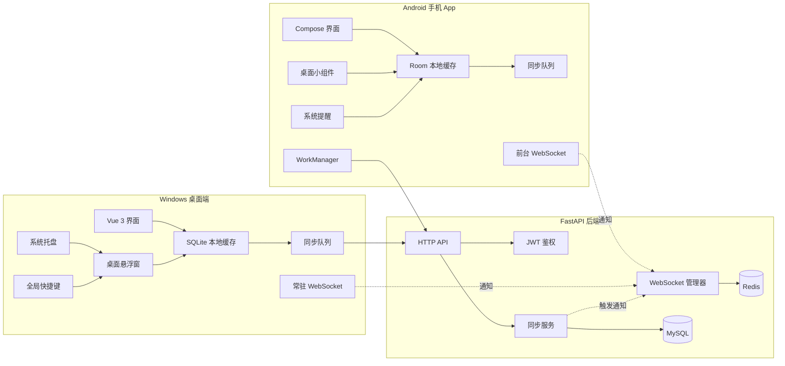
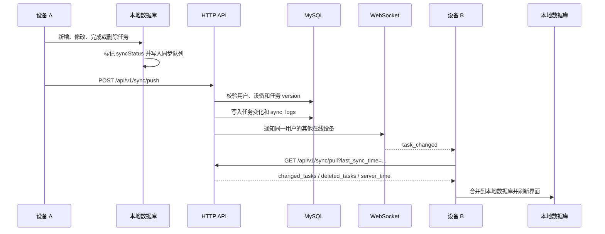

# TaskBridge

TaskBridge 是一款面向多设备场景的跨平台云同步待办应用，第一版覆盖后端服务、Android 手机 App 和 Windows 桌面端。项目不做 Web 端，重点解决任务在手机与电脑之间的连续流转：离线可用、本地优先、网络恢复后自动同步，并通过 WebSocket 通知让其他在线设备及时拉取最新数据。

核心原则很明确：HTTP API 负责真实数据同步，WebSocket 只负责通知。客户端收到任务变化通知后，再调用增量同步接口拉取数据，避免把完整任务数据塞进长连接消息里。

## 项目亮点

- **多设备同步：** Android 与 Windows 使用同一个账号体系，任务变更可在多设备间同步。
- **离线优先：** 客户端操作先写本地数据库，网络恢复后再上传同步队列。
- **增量同步：** 通过 `last_sync_time` 拉取服务端变化，减少全量刷新成本。
- **冲突控制：** 任务使用 `version` 做乐观锁，客户端可选择采用云端或覆盖云端。
- **移动端小组件：** Android 桌面小组件展示今日待办，数据来自本地 Room。
- **桌面悬浮窗：** Windows 端常驻悬浮窗展示今日任务，支持快速添加和完成。
- **系统集成：** Windows 支持托盘、全局快捷键、系统通知和开机自启；Android 支持提醒通知、分享添加和 WorkManager 后台同步。
- **后端工程化：** FastAPI、SQLAlchemy 2.x、Alembic、MySQL、Redis、JWT、Refresh Token、OpenAPI 文档和自动化测试已接入。

## 技术栈

| 模块 | 技术 |
| --- | --- |
| 后端 | Python 3.11+、FastAPI、SQLAlchemy 2.x、MySQL、Redis、Pydantic、JWT、Refresh Token、bcrypt、Alembic、Docker |
| Android | Kotlin、Jetpack Compose、Room、Retrofit、OkHttp WebSocket、WorkManager、DataStore、NotificationManager、AppWidget |
| Windows 桌面端 | Electron、Vue 3、TypeScript、Pinia、SQLite、原生 fetch、WebSocket、electron-store、electron-builder |
| 同步协议 | HTTP 增量同步、客户端变更上传、WebSocket 变更通知、任务版本控制、软删除、同步日志 |

## 架构图



## 同步流程图



## 功能模块

### 后端服务

- 用户注册、登录、刷新 Token 和当前用户信息。
- 设备注册、设备列表和设备删除。
- 任务增删改查、完成、恢复、软删除、回收站、彻底删除。
- 今日、收件箱、逾期、本周、高优先级、已完成、待同步、冲突和模板视图。
- 子清单、任务模板、重复任务、稍后提醒、计划日期、项目和标签。
- 批量完成、批量删除、批量计划、导入任务、导出任务。
- HTTP 增量同步、客户端离线变更上传、同步日志记录。
- WebSocket 在线设备管理、心跳、断线重连支持和同账号多设备通知。
- 登录、注册、刷新 Token 和 WebSocket Ticket 的基础限流。

### Android 手机 App

- 登录、注册、Token 保存和自动刷新。
- 任务列表、今日任务、任务详情、添加和编辑。
- 本地 Room 缓存、离线新增、离线修改、离线删除。
- WorkManager 网络恢复后自动同步。
- App 前台 WebSocket 通知，后台不强制常驻。
- 系统任务提醒，支持完成和稍后 1 小时。
- Android 桌面小组件显示今日待办，支持刷新、添加和点击进入 App。
- 分享文本快速添加任务，支持导入 TaskBridge 备份 JSON。
- 批量完成、批量删除、冲突处理和同步状态显示。

### Windows 桌面端

- 登录、注册、Token 保存和自动刷新。
- 本地 SQLite 缓存和离线操作。
- Windows 常驻 WebSocket，收到通知后触发增量拉取。
- 系统托盘、桌面悬浮窗、全局快捷键 `Ctrl + Alt + T`。
- 悬浮窗展示今日待办，支持快速添加、完成、隐藏和透明度保存。
- 系统通知、开机自启配置、本地提醒循环。
- 备份导出、备份导入、项目和标签重命名。
- 批量完成、批量删除、冲突处理和同步状态显示。

## 目录结构

### 后端

```text
backend/
  app/
    api/
    core/
    models/
    repositories/
    schemas/
    services/
    utils/
    main.py
  alembic/
  backend/docs/
  tests/
  Dockerfile
  docker-compose.yml
  requirements.txt
  requirements-dev.txt
  alembic.ini
  .env.example
```

### Android

```text
android/
  app/
    src/main/
      java/com/taskbridge/app/
        data/
        domain/
        notification/
        sync/
        ui/
        widget/
        MainActivity.kt
        AppContainer.kt
      res/
        drawable/
        layout/
        values/
        xml/
  build.gradle.kts
  settings.gradle.kts
  gradlew.bat
```

### Windows 桌面端

```text
desktop/
  electron/
    main.ts
    preload.ts
    ipc.ts
    db.ts
    tray.ts
    floating-window.ts
    shortcut.ts
    notification.ts
    auto-start.ts
    state.ts
  src/
    api/
    components/
    db/
    stores/
    sync/
    views/
    App.vue
    main.ts
  package.json
  electron-builder.json
  electron.vite.config.ts
  tsconfig.json
```

## 本地开发环境

- Python 3.11+
- MySQL 8.0+
- Redis 7+
- Docker Desktop（可选）
- JDK 21
- Android Studio 2025.2.2 或兼容版本
- Android SDK Platform 35
- Node.js 20+ 或 22+
- Windows 10/11（用于 Electron 桌面能力验证）

## 后端启动方式

```powershell
cd backend
python -m venv .venv
.\.venv\Scripts\Activate.ps1
pip install -r requirements-dev.txt
Copy-Item .env.example .env
alembic upgrade head
uvicorn app.main:app --reload
```

使用 Docker 启动：

```powershell
cd backend
Copy-Item .env.example .env
docker compose up --build
```

OpenAPI 文档地址：

```text
http://127.0.0.1:8000/docs
http://127.0.0.1:8000/redoc
```

## Android 启动方式

项目已适配国内 Maven 镜像。建议使用 Gradle Wrapper，不依赖全局 Gradle。

```powershell
cd android
.\gradlew.bat :app:assembleDebug
```

连接本机后端模拟器地址：

```powershell
.\gradlew.bat :app:assembleDebug `
  -PTASKBRIDGE_BASE_URL=http://10.0.2.2:8000/api/v1/ `
  -PTASKBRIDGE_WS_URL=ws://10.0.2.2:8000/ws/sync
```

如果 Gradle Wrapper 在离线环境无法下载发行包，请先准备 Gradle 8.9 缓存，或在有网络环境执行一次构建。

## Windows 桌面端启动方式

```powershell
cd desktop
npm install
npm run dev
```

类型检查和打包：

```powershell
npm run typecheck
npm run build
npm run dist
```

## 环境变量说明

后端环境变量写入 `backend/.env`。

| 变量 | 说明 |
| --- | --- |
| `APP_NAME` | 应用名称 |
| `ENV` | 运行环境，例如 `local`、`test`、`prod` |
| `DATABASE_URL` | MySQL 连接地址 |
| `REDIS_URL` | Redis 连接地址 |
| `JWT_SECRET_KEY` | JWT 签名密钥 |
| `JWT_ALGORITHM` | JWT 算法，默认 `HS256` |
| `ACCESS_TOKEN_EXPIRE_MINUTES` | Access Token 有效期 |
| `REFRESH_TOKEN_EXPIRE_DAYS` | Refresh Token 有效期 |
| `WEBSOCKET_TICKET_EXPIRE_SECONDS` | WebSocket Ticket 有效期 |

客户端后端地址通过配置或构建参数传入，不应硬编码生产地址。

## API 接口说明

所有 HTTP 接口统一返回：

```json
{
  "code": 0,
  "message": "success",
  "data": {}
}
```

核心接口：

```text
POST /api/v1/auth/register
POST /api/v1/auth/login
POST /api/v1/auth/refresh
GET  /api/v1/auth/me
POST /api/v1/auth/ws-ticket

POST   /api/v1/devices/register
GET    /api/v1/devices
DELETE /api/v1/devices/{device_id}

GET    /api/v1/tasks
POST   /api/v1/tasks
GET    /api/v1/tasks/{task_id}
PUT    /api/v1/tasks/{task_id}
DELETE /api/v1/tasks/{task_id}
POST   /api/v1/tasks/{task_id}/complete
POST   /api/v1/tasks/{task_id}/undo-complete
POST   /api/v1/tasks/{task_id}/restore
POST   /api/v1/tasks/{task_id}/postpone
POST   /api/v1/tasks/{task_id}/snooze
POST   /api/v1/tasks/{task_id}/plan
POST   /api/v1/tasks/{task_id}/next-occurrence
GET    /api/v1/tasks/{task_id}/history
POST   /api/v1/tasks/{task_id}/resolve-conflict
GET    /api/v1/tasks/meta
GET    /api/v1/tasks/export
POST   /api/v1/tasks/import
POST   /api/v1/tasks/batch
POST   /api/v1/tasks/projects/rename
POST   /api/v1/tasks/tags/rename

GET  /api/v1/sync/pull?last_sync_time=...
POST /api/v1/sync/push
```

更多同步示例见 [后端同步示例](./backend/docs/sync-examples.md)，接口设计见 [API 设计](./docs/api-design.md)。

## 同步机制说明

客户端任务表额外维护：

- `local_id`
- `server_id`
- `sync_status`
- `local_updated_at`
- `last_sync_at`

`sync_status` 可选值：

- `synced`
- `pending_create`
- `pending_update`
- `pending_delete`
- `conflict`

同步策略：

1. 客户端新增、修改、完成或删除任务时，先写本地数据库。
2. 本地任务标记 `sync_status`，同时写入同步队列。
3. 网络可用时调用 `POST /api/v1/sync/push` 上传变更。
4. 服务端校验任务归属和 `version`，写入 MySQL 并记录 `sync_logs`。
5. 服务端通过 WebSocket 通知同一用户下的其他在线设备。
6. 其他设备收到通知后调用 `GET /api/v1/sync/pull` 拉取增量数据。
7. 客户端合并本地数据，刷新界面、小组件或悬浮窗。

## WebSocket 说明

推荐连接流程：

1. 客户端使用 Access Token 调用 `POST /api/v1/auth/ws-ticket`。
2. 服务端返回短期 Ticket。
3. 客户端连接 `ws://host/ws/sync?ticket=<ticket>&device_id=<device_id>`。
4. 客户端定期发送 `ping` 或 `{ "event": "ping" }`。
5. 服务端返回 `pong`，并更新在线设备状态。

通知格式：

```json
{
  "event": "task_changed",
  "action": "updated",
  "task_id": 123,
  "version": 5,
  "server_time": "2026-05-17T12:00:00Z"
}
```

WebSocket 不返回完整任务内容，客户端必须通过 HTTP 增量同步拉取真实数据。

## 离线缓存说明

- Android 使用 Room 保存任务、同步队列和本地状态。
- Windows 使用 SQLite 保存任务、同步队列和本地状态。
- Android 小组件和 Windows 悬浮窗都只读取本地数据库。
- 网络同步由客户端主流程、WorkManager 或 SyncManager 触发。
- 离线期间用户仍可新增、修改、完成和删除任务。
- 网络恢复后，客户端按队列上传本地变更，再拉取云端遗漏数据。

## 测试与验证

后端测试：

```powershell
python -m pytest backend\tests -q
python -m compileall -q backend\app backend\tests
```

Android 构建：

```powershell
cd android
.\gradlew.bat :app:assembleDebug
```

Windows 桌面端：

```powershell
cd desktop
npm run typecheck
npm run build
```

## 项目开发路线

- **阶段 1：基础后端。** 用户认证、任务 CRUD、设备注册、数据库迁移和统一响应。
- **阶段 2：同步能力。** 增量拉取、离线上传、任务版本、同步日志和 WebSocket 通知。
- **阶段 3：Android MVP。** 登录、任务列表、本地缓存、同步、提醒和桌面小组件。
- **阶段 4：Windows MVP。** 登录、SQLite、本地同步、托盘、悬浮窗、快捷键和通知。
- **阶段 5：效率增强。** 批量操作、项目标签、模板、重复任务、导入导出和冲突处理。
- **阶段 6：发布准备。** CI、安装包、签名、部署脚本、性能压测和异常监控。

## 简历项目描述

TaskBridge 是一款跨平台云同步待办应用，覆盖 FastAPI 后端、Android 手机 App 和 Electron Windows 桌面端。项目采用本地优先架构，客户端通过 Room / SQLite 支持离线新增、修改和删除任务，网络恢复后通过 HTTP 增量同步与服务端保持一致；WebSocket 只承担轻量通知，避免长连接传输完整业务数据。后端实现 JWT + Refresh Token 鉴权、设备管理、任务版本控制、同步日志和在线设备通知；Android 端实现 WorkManager 后台同步、系统提醒和桌面小组件；Windows 端实现系统托盘、桌面悬浮窗、全局快捷键和本地提醒，适合展示跨端同步、离线缓存和工程化落地能力。
