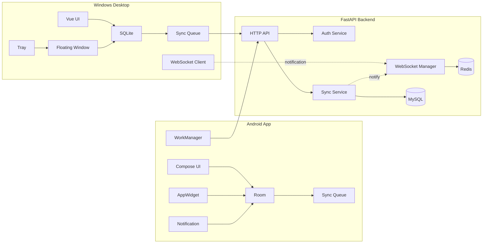

# 架构说明

TaskBridge 由后端服务、Web/PWA、Android App 和 Windows 桌面端组成。系统采用本地优先架构，客户端先写本地数据库，再通过同步队列与服务器保持一致。

## 产品边界

- **后端服务：** 负责账号、设备、任务持久化、同步顺序、同步日志和 WebSocket 通知。
- **Android App：** 负责移动端任务管理、本地缓存、后台同步、系统提醒和桌面小组件。
- **Web/PWA：** 负责浏览器端任务查看、新建、编辑、搜索、完成、删除、恢复和后端同步状态查看；远程任务列表通过 `cursor_id` / `cursor_updated_at` 分页拉取，避免只展示第一页；通过 IndexedDB 保存任务快照和离线队列，恢复在线后自动同步本地 mutation。
- **Windows 桌面端：** 负责桌面端任务管理、本地缓存、托盘、悬浮窗、全局快捷键和常驻 WebSocket。

## 架构原则

1. 客户端本地优先，所有用户操作先写入本地数据库；Web/PWA 使用 IndexedDB 承载浏览器端缓存和 offline queue。
2. HTTP API 是唯一真实同步通道。
3. WebSocket 只发送通知，不承载完整任务数据。
4. 服务端是服务器侧权威数据源，任务归属必须按 `user_id` 校验。
5. 同步冲突通过任务 `version` 做乐观锁检测。
6. Android 后台同步交给 WorkManager，不长期保活 WebSocket。
7. Windows 桌面端可常驻 WebSocket，并在断线后自动重连。
8. 客户端渲染层不直接持有数据库、Token 和系统能力，敏感操作必须经过受控桥接层。
9. 任务时间线排序属于跨端契约，后端、Android、Windows 桌面端必须使用 `shared/task-timeline-fixtures.json` 的同一组样本验证完成态别名、逾期、计划日期、优先级、手动排序和完成时间倒序。

## 跨端排序契约

任务列表默认按“逾期、即将到期、计划日期、无时间、已完成”排序；完成状态读取时同时接受 `completed` 和历史别名 `done`，写入时统一写 canonical `completed`。`shared/task-timeline-fixtures.json` 是这套行为的共享测试向量：

- 后端通过 `backend/tests/test_task_timeline_fixtures.py` 验证 `/api/v1/tasks` 普通列表、cursor 分页、today 视图和 meta 计数。
- Android 通过 `TaskTimelineTest` 和 `TodayTaskWidgetRepositoryTest` 验证领域排序和小组件 raw projection 排序。
- Windows 桌面端通过 `npm run check:task-order` 验证 Vue 排序工具和 Electron SQLite 查询不会退回单值 `completed` 判断。

## 模块图

## 后端职责

后端维护用户、设备、任务、同步日志和在线设备状态。

主要目录：

| 目录 | 职责 |
| --- | --- |
| `app/api` | FastAPI 路由和鉴权依赖 |
| `app/core` | 配置、安全、数据库、Redis、统一响应和异常处理 |
| `app/models` | SQLAlchemy ORM 模型 |
| `app/schemas` | Pydantic 请求和响应模型 |
| `app/services` | 认证、任务、设备、同步和 WebSocket 业务流程 |
| `app/repositories` | 复杂数据访问边界 |
| `tests` | 后端自动化测试 |

## 客户端职责

Android 和 Windows 都需要维护：

- 当前登录用户。
- 当前设备 ID。
- Access Token 和 Refresh Token。
- 最近一次成功拉取时间 `last_sync_time`。
- 等待上传的本地变更队列。
- 任务本地状态和同步状态。

## 数据流

1. 用户在客户端新增、编辑、完成或删除任务。
2. 客户端写入本地数据库。
3. 客户端将任务标记为 `pending_create`、`pending_update` 或 `pending_delete`。
4. 网络可用时，客户端调用 `POST /api/v1/sync/push`。
5. 后端校验用户、设备、任务归属和 `version`。
6. 后端写入任务数据和 `sync_logs`。
7. 后端通过 WebSocket 通知同账号下其他在线设备。
8. 其他设备收到通知后调用 `GET /api/v1/sync/pull`。
9. 客户端合并增量数据并更新本地界面、小组件或悬浮窗。

## 运维组件

- **MySQL：** 保存用户、设备、任务和同步日志。
- **Redis：** 用于在线设备状态、WebSocket 辅助、短期 Ticket 和限流扩展。
- **Alembic：** 管理数据库迁移。
- **Docker Compose：** 用于本地联调后端、MySQL 和 Redis。
- **GitHub Actions：** 用于 CI、Release 和 GHCR 镜像发布。

## 安全边界

- 后端所有业务数据按 `user_id` 过滤，任务父子关系也必须校验归属。
- Refresh Token 绑定设备；删除设备会撤销该设备登录态。
- WebSocket 使用短期 Ticket，连接后仍校验 `device_id`。
- Android Release 必须使用正式签名，缺少签名配置时构建失败。
- Windows Electron renderer 启用 sandbox，IPC 会校验调用方窗口。
- Docker release 部署默认只暴露 API，MySQL 和 Redis 保持在 Compose 内部网络。
