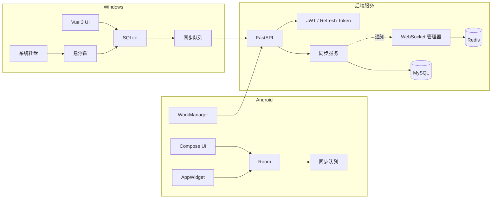

# TaskBridge 架构说明

## 产品边界

TaskBridge 第一版只包含 3 个运行端：

- **后端服务：** 负责账号、设备、任务持久化、同步顺序、同步日志和 WebSocket 通知。
- **Android 手机 App：** 负责移动端任务管理、本地缓存、后台同步、系统提醒和桌面小组件。
- **Windows 桌面端：** 负责桌面端任务管理、本地缓存、系统托盘、悬浮窗、全局快捷键和常驻 WebSocket。

项目暂不包含 Web 端。Vue 只运行在 Electron 桌面端内，不作为独立 Web 产品交付。

## 架构原则

1. 客户端本地优先，所有用户操作先写入本地数据库。
2. HTTP API 是真实同步通道。
3. WebSocket 只做轻量通知，不承载完整任务数据。
4. 服务端是云端权威数据源，所有任务归属必须按 `user_id` 校验。
5. 同步冲突通过任务 `version` 做乐观锁检测。
6. Android 后台不长期保活 WebSocket，后台同步交给 WorkManager。
7. Windows 桌面端可以常驻 WebSocket。

## 后端职责

后端维护用户、设备、任务、同步日志和在线设备状态。

主要模块：

- `core`：配置、安全、数据库、Redis、统一响应和异常处理。
- `api`：FastAPI 路由、鉴权依赖和接口入口。
- `models`：SQLAlchemy ORM 模型。
- `schemas`：Pydantic 请求和响应模型。
- `services`：认证、任务、设备、同步和 WebSocket 业务流程。
- `repositories`：复杂数据访问边界。
- `tests`：后端自动化测试。

## 客户端职责

Android 与 Windows 都维护本地数据库。用户操作会先写本地状态，再进入同步队列。

客户端需要维护：

- 当前登录用户。
- 当前设备 ID。
- Access Token 和 Refresh Token。
- 最近一次拉取成功时间 `last_sync_time`。
- 等待上传的本地变更队列。
- 任务本地状态和同步状态。

## 数据流

1. 用户在客户端新增、编辑、完成或删除任务。
2. 客户端写入本地数据库。
3. 客户端将任务标记为 `pending_create`、`pending_update` 或 `pending_delete`。
4. 网络可用时调用 `POST /api/v1/sync/push`。
5. 后端校验用户、设备、任务归属和 `version`。
6. 后端写入任务数据和 `sync_logs`。
7. 后端通过 WebSocket 通知同账号下其他在线设备。
8. 其他设备收到通知后调用 `GET /api/v1/sync/pull`。
9. 客户端合并增量数据并更新本地界面。

## 架构图

## 运维组件

- MySQL 保存用户、设备、任务和同步日志等持久化数据。
- Redis 用于在线设备状态、WebSocket 通知辅助、短期 Ticket 和后续限流扩展。
- Docker Compose 用于本地 MySQL、Redis 和后端服务联调。
- Alembic 负责数据库迁移。
